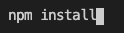
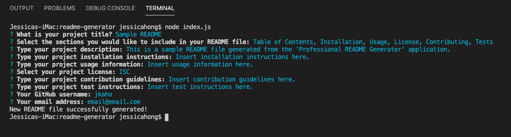
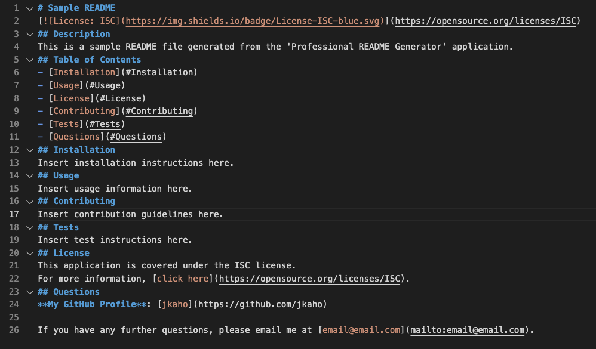
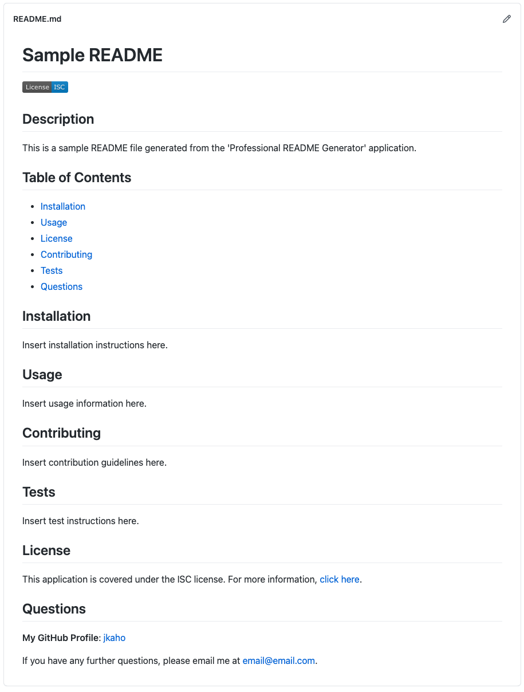

# Professional README Generator 

## Description
This is a command-line application that creates professionally structured README.md files. The user must input a project title and description, as well as their GitHub username and email to be added to the 'Questions' section of the README file. Users also have the choice of including any of the following sections:
- Table of Contents
- Installation
- Usage
- License
- Contributing
- Tests

The application takes a user's responses to the command-line prompts to use as content for the README file. 

## Table of Contents
- [Motivations](#Motivations)
- [Installation](#Installation)
- [Video Walkthrough](#Video-Walkthrough)
- [Technologies Used](#Technologies-Used)
- [Screenshots](#Screenshots)
- [License](#License)
- [Questions](#Questions)

## Motivations 
The main motivation for this project was to create an application that facilitates the documentation aspect of projects for developers, which can be tedious and repetitive. 

## Installation
1. Clone this repository to your local computer
2. Open the command line and navigate to the cloned repository (the 'readme-generator' directory)
3. Install dependencies (npm inquirer package) by entering the command: npm install

## Video Walkthrough
[Click here](https://drive.google.com/file/d/1I4z7O5Df3SYU64YqFhRczU2Q6OSWPIYO/view?usp=sharing) to view a video walkthrough of the README generator functionality.

## Technologies Used 
- JavaScript
- Command-line interface
- Node.js
- npm inquirer package 
- Screencastify

## Screenshots

### Application Interface

### Generated README.md source code

### Generated README.md viewed in GitHub repository

## License
This application is covered under the ISC license.
For more information, [click here](https://opensource.org/licenses/ISC).

## Questions
**My GitHub Profile**: [jkaho](https://github.com/jkaho)

If you have any further questions, please email me at [j.h_7@yahoo.com](mailto:j.h_7@yahoo.com).
